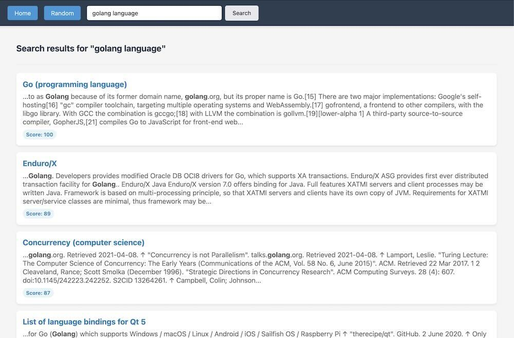

# zim-cgo

A Go bindings for the [Zim](https://github.com/openzim/libzim) library that provides full text search capabilities and a native Go HTTP server.

## Features

- **Full text search**: Unlike my native Go alternative, these bindings implement full text search functionality
- **Native Go HTTP server**: Built-in HTTP server using Go's standard library

## Alternatives

There is a native Go alternative available at https://github.com/akhenakh/gozim CGO free, it does not implement full text search due to Xapian availability in Go.

## Gozimhttp

Gozimhttp is a web server using zim-cgo, to browse a zim file.

## Implementation Details
CGO bindings, since it's leveraging the C++ libraries (libzim, xapian ...), you need to install those dependencies.
This port provides full text search and a native-to-Go HTTP server. 

## License

Because of the libzim license and static linking, this package is tainted by the GPL2.
